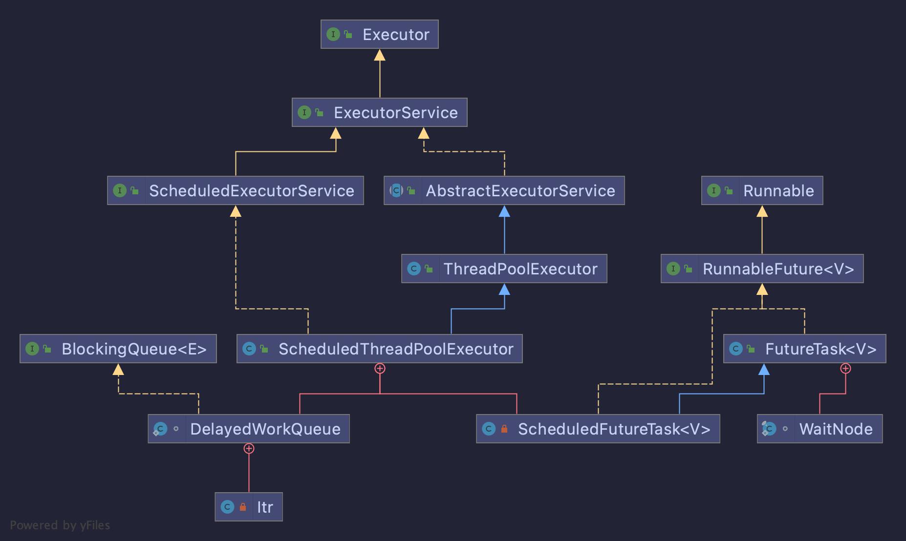

# 定时任务（二） ---- ScheduledThreadPoolExecutor实现定时任务

> 上一篇已经分享了jdk的Timer实现，实际上Java5.0以后版本，已经推荐使用ScheduledThreadPoolExecutor替代Timer。
> 接下来就看一下 ScheduledThreadPoolExecutor是怎样实现的


我们来看下ScheduledThreadPoolExecutor的实现设计，下面给出了ScheduledThreadPoolExecutor的类图



可以看出，和Timer类似，ScheduledThreadPoolExecutor的核心组件除了正常的线程池功能以外。
ScheduledThreadPoolExecutor 调度功能的实现主要就由 ScheduledFutureTask 与DelayedWorkQueue这两个内部类了。
-  `ScheduledFutureTak` 定时任务

ScheduledFutureTask内部类继承了FutureTask，实现了Runnable，以此实现了可回调结果的任务线程，同时还实现了Delayed接口（getDelay方法用于返回距离下次任务执行时间的时间间隔）

- `DelayedWorkQueue` 延时队列

DelayedWorkQueue内部类就是一个阻塞队列，不过自己实现了类似Timer里面的基于任务执行时间动态排序的优先级队列。

- `ScheduledThreadPoolExecutor` 线程池

 这块核心除了线程池，其实就是内部优先级队列的实现了

## 源码跟踪


```java

    public ScheduledFuture<?> scheduleAtFixedRate(Runnable command,
                                                  long initialDelay,
                                                  long period,
                                                  TimeUnit unit) {
        if (command == null || unit == null)
            throw new NullPointerException();
        if (period <= 0L)
            throw new IllegalArgumentException();
        // 通过提交的Runnable对象，构造一个ScheduledFutureTask对象
        ScheduledFutureTask<Void> sft =
            new ScheduledFutureTask<Void>(command,
                                          null,
                                          triggerTime(initialDelay, unit),
                                          unit.toNanos(period),
                                          sequencer.getAndIncrement());
        RunnableScheduledFuture<Void> t = decorateTask(command, sft);
        sft.outerTask = t;
        //延迟执行t
        delayedExecute(t);
        return t;
    }
    
 ```
这里可以看到就是将提交的Runnable对象封装成ScheduledFutureTask对象，然后delayedExecute()执行任务。

```java
    public void run() {
        //判断为非可执行任务状态时，取消任务
        if (!canRunInCurrentRunState(this))
            cancel(false);
        //不是周期性任务，直接执行  
        else if (!isPeriodic())
            super.run();
        //是周期性任务runAndReset方法会执行在执行结束时将任务的状态重置为NEW，便于下次再次执行   
        else if (super.runAndReset()) {
            setNextRunTime();
            reExecutePeriodic(outerTask);
        }
    }
  ```


（注意进方法内部可以看到，判断中多一个关闭线程池后是否继续执行后续延迟任务或周期性任务，
就是说ScheduledThreadPoolExecutor提供了一个关闭线程池，仍然执行定时任务的方法）

````java

    boolean canRunInCurrentRunState(RunnableScheduledFuture<?> task) {
        if (!isShutdown())
            return true;
        if (isStopped())
            return false;
        return task.isPeriodic()
            //关闭后继续现有的定期任务
            ? continueExistingPeriodicTasksAfterShutdown
            //关闭后执行现有的延迟任务
            : (executeExistingDelayedTasksAfterShutdown
               || task.getDelay(NANOSECONDS) <= 0);
    }
    
````

```java
    /**
     * 请求周期性任务，除非当前运行状态排除该任务。
     * 与delayedExecute相同，只是删除任务而不是拒绝。
     */
    void reExecutePeriodic(RunnableScheduledFuture<?> task) {
        if (canRunInCurrentRunState(task)) {
            //将任务重新入队
            super.getQueue().add(task);
            if (canRunInCurrentRunState(task) || !remove(task)) {
                ensurePrestart();
                return;
            }
        }
        task.cancel(false);
    }
  ```


```java
/**
 * 与prestartCoreThread相同，不同的是即使corePoolSize为0，也至少启动一个线程。
 */
void ensurePrestart() {
    int wc = workerCountOf(ctl.get());
    //如果线程池小于核心线程数，新建线程执行，否则在队列中等待线程池中的线程调用getTask方法
    if (wc < corePoolSize)
        addWorker(null, true);
    else if (wc == 0)
        addWorker(null, false);
}
```

延迟或周期性任务的主要执行方法。如果池已关闭，则拒绝该任务。
否则，将任务添加到队列中，并在必要时启动一个线程来运行它如果在添加任务时关闭了池，
请根据状态和关闭后运行参数的要求取消并删除它。

```java

    private void delayedExecute(RunnableScheduledFuture<?> task) {
        if (isShutdown())
            reject(task);
        else {
            super.getQueue().add(task);
            //入队后有个反悔期，如果线程池已关闭，移除任务
            if (!canRunInCurrentRunState(task) && remove(task))
                task.cancel(false);
            else
                // 如果线程数量小于核心线程数，则新建线程执行任务
                ensurePrestart();
        }
    }
 
 ```


## DelayedWorkQueue延迟队列

```java
// 初始容量
private static final int INITIAL_CAPACITY = 16;	
// 节点数量
private int size = 0;
// 存放任务的数组
private RunnableScheduledFuture<?>[] queue = new RunnableScheduledFuture<?>[INITIAL_CAPACITY];	
// 控制并发用的锁
private final ReentrantLock lock = new ReentrantLock();
//指定用于等待队列头节点任务的线程
private Thread leader;
// 条件队列
private final Condition available = lock.newCondition();

```
```java
    public boolean offer(Runnable x) {
        if (x == null)
            throw new NullPointerException();
        RunnableScheduledFuture<?> e = (RunnableScheduledFuture<?>)x;
        // 使用lock保证并发操做安全
        final ReentrantLock lock = this.lock;
        lock.lock();
        try {
            int i = size;
            // 若是要超过数组长度，就要进行数组扩容
            if (i >= queue.length)
                // 数组扩容
                grow();
            // 将队列中元素个数加一
            size = i + 1;
            // 若是是第一个元素，那么就不须要排序，直接赋值就好了
            if (i == 0) {
                queue[0] = e;
                setIndex(e, 0);
            } else {
                // 调用siftUp方法，使插入的元素变得有序。
                siftUp(i, e);
            }
            // 表示新插入的元素是队列头，更换了队列头，
            // 那么就要唤醒正在等待获取任务的线程。
            if (queue[0] == e) {
                leader = null;
                // 唤醒正在等待等待获取任务的线程
                available.signal();
            }
        } finally {
            lock.unlock();
        }
        return true;
    }
    
```


```java

    public RunnableScheduledFuture<?> take() throws InterruptedException {
        final ReentrantLock lock = this.lock;
        lock.lockInterruptibly();
        try {
            for (;;) {
                RunnableScheduledFuture<?> first = queue[0];
                // 若是没有任务，就让线程在available条件下等待。
                if (first == null)
                    available.await();
                else {
                    // 获取任务的剩余延时时间
                    long delay = first.getDelay(NANOSECONDS);
                    // 若是延时时间到了，就返回这个任务，用来执行。
                    if (delay <= 0)
                        return finishPoll(first);
                    // 将first设置爲null，当线程等待时，不持有first的引用
                    first = null; // don't retain ref while waiting

                    // 若是仍是原来那个等待队列头任务的线程，
                    // 说明队列头任务的延时时间尚未到，继续等待。
                    if (leader != null)
                        available.await();
                    else {
                        // 记录一下当前等待队列头任务的线程
                        Thread thisThread = Thread.currentThread();
                        leader = thisThread;
                        try {
                            // 当任务的延时时间到了时，可以自动超时唤醒。
                            available.awaitNanos(delay);
                        } finally {
                            if (leader == thisThread)
                                leader = null;
                        }
                    }
                }
            }
        } finally {
            if (leader == null && queue[0] != null) // 唤醒等待任务的线程
                available.signal();
            lock.unlock();
        }
    }
```


## 总结
ScheduledThreadPoolExecutor 与Timer的实现流程差不多，都是维护一个优先级队列来获取最早需要执行的任务，然后通过线程进行消费，区别就是ScheduledThreadPoolExecutor 实现多线程去运行任务，任务之间不会相互影响。其中周期性执行都是通过重置任务下一次执行时间来完成的。

同时需要注意的是，使用ScheduledThreadPoolExecutor 去执行任务，由于使用的是多线程，默认当任务执行出错，不会发生像Timer一样某个任务异常导致整体的失败 （所以注意使用ScheduledThreadPoolExecutor 去调度的任务，重写任务的业务时，记得自己捕捉好异常进行处理，否则程序不会报任何的错误）

其中不管是Timer，还是ScheduledThreadPoolExecutor ，其优先级队列任务添加、删除复杂度还是O(logn), 这在需要操作调度大量任务的一些框架将成为其性能瓶颈。下一篇我们在来看下时间轮算法是如何优化这个问题的。


