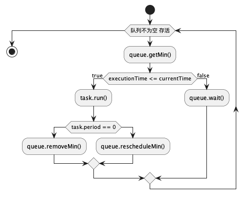

# 定时任务（一） ---- Java Timer实现定时任务

## 
会议提前15分钟自动提醒，酒店的自动叫早服务，自定义算法的任务调度，其基本的实现都是都是定时任务，用来调度定时执行的任务和执行一次的任务。

如何实现一个定时任务，稍加思考，很容易得到答案:`线程` + `队列`。

Java JDK1.3就提供了java.util.Timer，来实现异步任务定时/周期执行等.
```java
    public static void main(String[] args) {
        Timer timer = new Timer();
        TimerTask task = new TimerTask() {
            @Override
            public void run() {
                System.out.println("定时任务调度一次!" + new Date(System.currentTimeMillis()));
            }
        };

        // 延迟 1s 打印一次
        // timer.schedule(task, 1000);
        // 延迟 1s 固定时延每隔 1s 周期打印一次
        timer.schedule(task, 1000, 1000);
        // 延迟 1s 固定速率每隔 1s 周期打印一次
        // timer.scheduleAtFixedRate(task, 1000, 1000);
    }

```
现在就来看一下`java.util.Timer`是如何实现这样的定时功能的, `Timer`有个2重要的模块，分别是 `TimerThread`, `TaskQueue`
```java
public class Timer {
    /**
     * 任务队列，TimerTask加入后会按执行时间自动排序
     */
    private final TaskQueue queue = new TaskQueue();

    /**
     * 工作线程，真正循环执行TimerTask的线程
     */
    private final TimerThread thread = new TimerThread(queue);
}

```
TaskQueue主要是通过优先队列存储`TimerTask`；
`TimerTask` 任务有四种状态：

`VIRGIN`： 任务刚刚创建，还没有schedule

`SCHEDULED`：任务已经schedule，进入到队列中

`EXECUTED`： 任务已执行/执行中

`CANCELLED`：任务已取消

跟踪定时器调用schedule()方法，可以看到jdk中，最后的源码实现为:

```java
    private void sched(TimerTask task, long time, long period) {
        if (time < 0)
            throw new IllegalArgumentException("Illegal execution time.");

        // Constrain value of period sufficiently to prevent numeric
        // overflow while still being effectively infinitely large.
        if (Math.abs(period) > (Long.MAX_VALUE >> 1))
            period >>= 1;

        synchronized (queue) {
            if (!thread.newTasksMayBeScheduled)
                throw new IllegalStateException("Timer already cancelled.");

            synchronized (task.lock) {
                if (task.state != TimerTask.VIRGIN)
                    throw new IllegalStateException("Task already scheduled or cancelled");
                // 封装 任务的执行时间 周期 状态
                task.nextExecutionTime = time;
                task.period = period;
                task.state = TimerTask.SCHEDULED;
            }
            // 任务入队
            queue.add(task);
            /**
             * 如果任务是队列当前第一个任务，则唤醒工作线程 这里是因为工作线程处理完上一个任务之后，
             * 会 sleep 到下一个 task 的执行时间点。 如果有 nextExecutionTime 更早的 task
             * 插队到前面，则需要马上唤醒工作线程进行检查 避免 task 延迟执行
             */
            if (queue.getMin() == task)
                queue.notify();
        }
    }

```

那么，在加入任务之后，整个Timer是怎么样运行的呢？可以看下面的示意图：


```java
class TimerThread extends Thread {
    boolean newTasksMayBeScheduled = true;
    private TaskQueue queue;

    TimerThread(TaskQueue queue) {
        this.queue = queue;
    }

    public void run() {
        try {
            mainLoop();
        } finally {
            // Someone killed this Thread, behave as if Timer cancelled
            synchronized (queue) {
                newTasksMayBeScheduled = false;
                queue.clear();  // Eliminate obsolete references
            }
        }

    /**
     * The main timer loop. (See class comment.)
     */
    private void mainLoop() {
        while (true) {
            try {
                TimerTask task;
                boolean taskFired;
                synchronized (queue) {
                    // Wait for queue to become non-empty
                    while (queue.isEmpty() && newTasksMayBeScheduled)
                        queue.wait();
                    if (queue.isEmpty())
                        break; // Queue is empty and will forever remain; die

                    // Queue nonempty; look at first evt and do the right thing
                    long currentTime, executionTime;
                    task = queue.getMin();
                    synchronized (task.lock) {
                        if (task.state == TimerTask.CANCELLED) {
                            queue.removeMin();
                            continue; // No action required, poll queue again
                        }
                        currentTime = System.currentTimeMillis();
                        executionTime = task.nextExecutionTime;
                        if (taskFired = (executionTime <= currentTime)) {
                            if (task.period == 0) { // Non-repeating, remove
                                queue.removeMin();
                                task.state = TimerTask.EXECUTED;
                            } else { // Repeating task, reschedule
                                queue.rescheduleMin(
                                    task.period < 0 ? currentTime - task.period : executionTime + task.period);
                            }
                        }
                    }
                    if (!taskFired) //任务尚未启动；等待
                        queue.wait(executionTime - currentTime);
                }
                if (taskFired) // 任务已启动；运行它，不要锁定
                    task.run();
            } catch (InterruptedException e) {
            }
        }
    }
}
```
定时系统的一个基础实现：线程循环 + 优先队列

有兴趣同学的可以去看看TaskQueue的实现，就是一个优先队列，这里就不讨论了。

## 总结
Timer单线程执行任务，任务有可能丢失或执行时间不准确。


Timer执行任务时只是创建了单个线程。如果一个时间任务执行的时间比较长，那么其他任务执行时间的准确性就会受影响。比如每隔1秒执行一次短任务，中间有个长任务在当前时间延迟1秒后执行，执行时间超过5秒，那么短任务就有可能丢失或者在5秒后连续快速的执行而非每隔1秒。

如果TimerTask抛出未检查的异常，Timer将产生无法预料的行为。Timer线程并不捕获异常，所以，TimerTask抛出未检查的异常会终止Timer线程。在这种情况下，Timer也不会恢复线程，而是错误地认为整个Timer线程被取消了。这时，已经在计划中但是还没有执行的TimerTask就再也不会运行了，新的任务也不会被安排了。  

